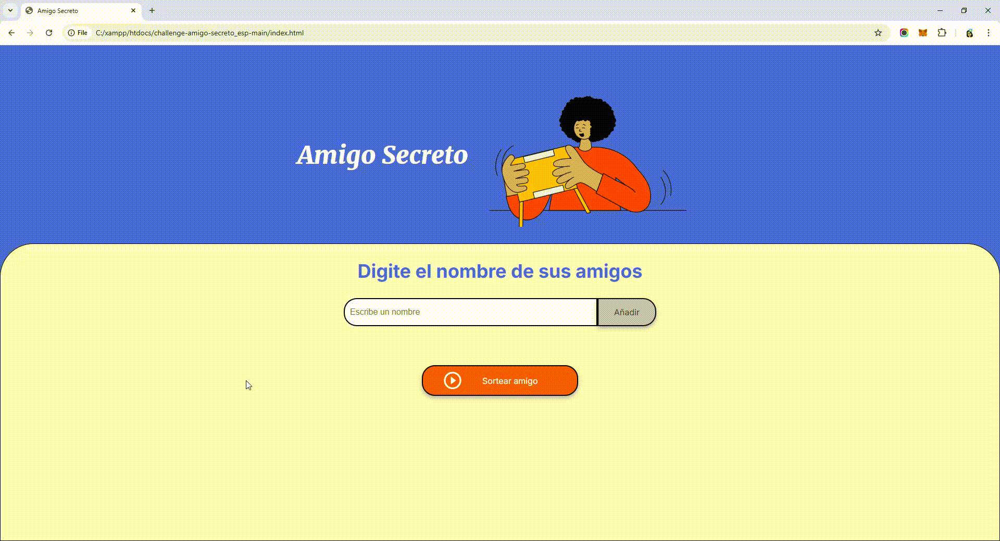

# 🎉 AMIGO SECRETO

Este es un pequeño proyecto en JavaScript que permite agregar nombres a una lista y realizar un sorteo aleatorio para elegir un "amigo secreto".

## 📋 Características

- Agregar nombres a la lista.
- Mostrar la lista actualizada en pantalla.
- Seleccionar un nombre aleatorio como "amigo secreto".

## 🚀 Instalación y Uso

1. **Clona este repositorio**  
   ```bash
   git clone https://github.com/Vaguuu/amigo_secreto
   ```
2. **Abre el archivo `index.html` en tu navegador**  
3. **Interacción con la aplicación**:
   - Escribe nombres en el campo de entrada y presiona "Añadir".
   - Una vez que hayas agregado los nombres, presiona "Sortear amigo".
## 🛠️ Tecnologías Utilizadas
    - HTML5
    - CSS3
    - JavaScript (DOM Manipulation)
## 📷 Captura de Pantalla


## 🤝 Contribuciones

Si quieres contribuir, ¡bienvenido! Puedes hacer un **fork** del repositorio y enviar un **pull request** con mejoras.

## 📄 Licencia

El proyecto fue creado por Alura Latam, en el marco del Curso **Practicando Lógica de Programación: Challenge Amigo secreto**
